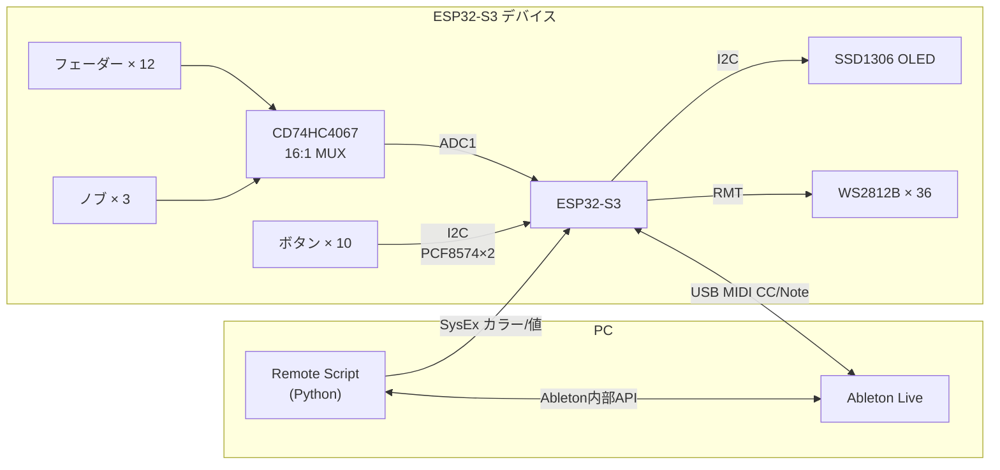
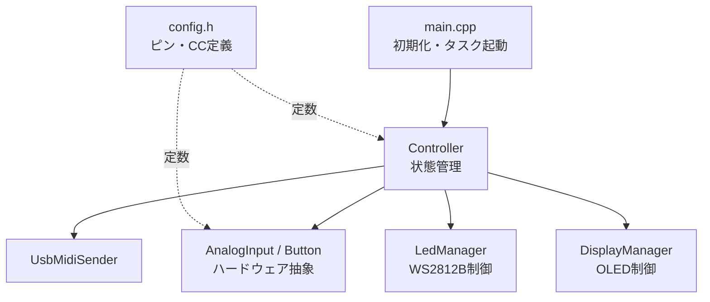

# MIDI Controller — 設計概要

> **全体確認が必要なときのみ参照。実装時は現在のPhaseファイルを読むこと。**

---

## 1. 目的・スコープ

Ableton Live での DJ・楽曲制作をフィジカルなコントローラーで操作する。

**スコープ内**
- フェーダー・ノブ・ボタン → USB MIDI CC/Note 送信
- Ableton のトラックカラー・ボリューム・ノブ値 → SysEx で受信しLED・OLEDに反映
- KiCad で基板設計 → JLCPCB 発注

**スコープ外**
- BLE MIDI（採用しない）
- DAW以外のホストとの接続

---

## 2. システム全体図



---

## 3. 開発フェーズ一覧

| Phase | 内容 | 完了条件 | 詳細 |
|---|---|---|---|
| **1** | USB MIDI E2E（フェーダー1本・直結） | フェーダー操作でAbletonのCC値が変わる | [phase1_usb_midi.md](phase1_usb_midi.md) |
| **2** | Ableton Remote Script（双方向SysEx） | カラー・ボリューム・ノブ値がSysExで届く | [phase2_script.md](phase2_script.md) |
| **3** | フル入出力（MUXなし） | フェーダー・ボタン・LED・OLEDが連携して動く | [phase3_full.md](phase3_full.md) |
| **4** | MUX導入（フェーダー12本） | 全フェーダーが正常に読み取れる | [phase4_mux.md](phase4_mux.md) |
| **5** | 最終仕上げ | 設定保存・起動アニメーション動作 | [phase5_final.md](phase5_final.md) |

---

## 4. ハードウェア構成

| コンポーネント | 型番 / 仕様 | 個数 |
|---|---|---|
| マイコン | ESP32-S3-DevKitC-1-N8 | 1 |
| アナログMUX | CD74HC4067（16:1） | 1 |
| ディスプレイ | SSD1306 OLED 128×64（I2C） | 1 |
| フェーダー | ポテンショメータ 10kΩ | 12 |
| ノブ | ポテンショメータ 10kΩ | 3（Bank1/2切り替えで6系統） |
| ボタン（MIDI用） | タクトスイッチ | 8 |
| バンク切り替えボタン | タクトスイッチ | 2 |
| I2C GPIOエクスパンダ | PCF8574 | 2（ボタン8個 + バンク2個を読み取り） |
| LED | WS2812B | 36 |

> ⚠️ **ADC制約**: BLE無効のためADC2も使用可能だが、設計はADC1（GPIO1–10）に統一する。

> **ピン割り当て詳細**: [../schematic/pin_assignment.md](../schematic/pin_assignment.md)
> **部品表**: [../bom/bom.md](../bom/bom.md)

---

## 5. ソフトウェアアーキテクチャ

### モジュール構成



### ディレクトリ構成

```
midi-controller/
├── CMakeLists.txt
├── sdkconfig.defaults
├── main/
│   ├── include/
│   │   ├── config.h          ← ピン・CC番号（constexpr）
│   │   ├── analog_input.h    ← IAnalogInput インターフェース
│   │   ├── button.h          ← IButton インターフェース
│   │   ├── midi_sender.h     ← IMidiSender インターフェース
│   │   ├── usb_midi.h
│   │   ├── led.h
│   │   ├── display_manager.h
│   │   └── controller.h
│   └── src/
│       ├── main.cpp
│       ├── analog_input.cpp
│       ├── button.cpp
│       ├── usb_midi.cpp
│       ├── led.cpp
│       ├── display_manager.cpp
│       └── controller.cpp
├── remote-script/
│   └── MidiController/
├── tests/
│   ├── unit/          ← GoogleTest（PC上・ソフトロジック）
│   ├── e2e/           ← Python + mido（MIDI受信検証）
│   └── integration/   ← ESP-IDF Unity（実機・ハードウェア）
└── docs/
    ├── design/
    └── schematic/ / bom/
```

---

## 6. スタブ設計

```cpp
class IAnalogInput { public: virtual uint16_t read() const = 0; };
class IButton      { public: virtual bool is_pressed() const = 0; };

class StubAnalogInput : public IAnalogInput {
    uint16_t read() const override { return 2048; }
};
class StubButton : public IButton {
    bool is_pressed() const override { return false; }
};
```

`config.h` の `#define USE_STUBS` でビルド時に切り替え。

---

## 7. MIDI アサイン（デフォルト）

すべて MIDI Ch.1。

| コントロール | CC / Note | 用途 |
|---|---|---|
| フェーダー 1–12 | CC 1–12 | トラックボリューム |
| ノブ Bank1-1 | CC 20 | Reverb (Send A) |
| ノブ Bank1-2 | CC 21 | Delay (Send B) |
| ノブ Bank1-3 | CC 22 | Lo-cut |
| ノブ Bank2-1 | CC 23 | Plugin param 1 |
| ノブ Bank2-2 | CC 24 | Plugin param 2 |
| ノブ Bank2-3 | CC 25 | Plugin param 3 |
| ボタン 1–8 | Note 36–43 | トリガー / エフェクト ON-OFF |
| バンク切り替え1 | — | ノブ Bank1 |
| バンク切り替え2 | — | ノブ Bank2 |

---

## 8. 非機能要件

| 項目 | 目標値 |
|---|---|
| MIDIレイテンシ | 10ms 以下（InputTask ポーリング周期） |
| 消費電流 | USB給電（500mA）内に収める |
| LED最大輝度 | MAX_BRIGHTNESS = 64/255（ソフトウェア制限） |
| ADC分解能 | 12bit → 7bit（`>> 5`、deadband=4） |

---

## 9. 初学者がハマりやすいポイント

| 分類 | ポイント |
|---|---|
| ADC | 非線形 → `adc_cali` キャリブレーション必須 |
| ADC | GND共通化しないとCC値が暴れる |
| TinyUSB | `tud_task()` をメインループで呼ぶこと |
| TinyUSB | `tusb_config.h` のMIDIクラス設定を確認 |
| WS2812B | RMT初期化順序ミスで全LED白点灯 |
| WS2812B | 3.3V→5Vレベル変換を忘れない |
| MUX | チャンネル切り替え後に数μs待つ（セトリング時間） |
| FreeRTOS | スタックサイズ不足でクラッシュ（デバッグ困難） |
