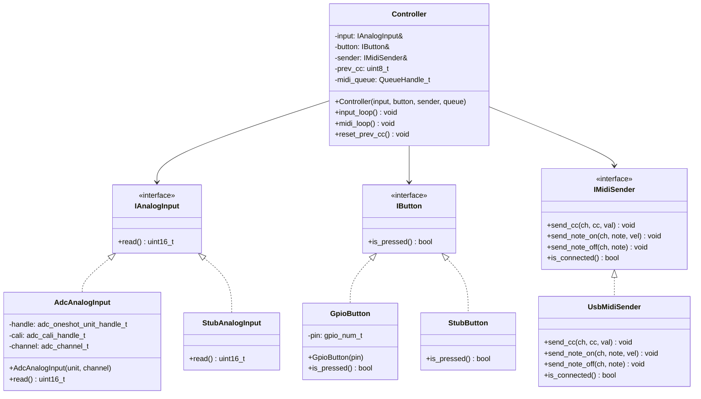
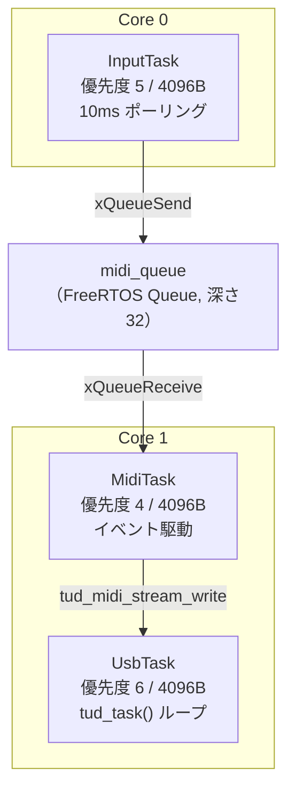
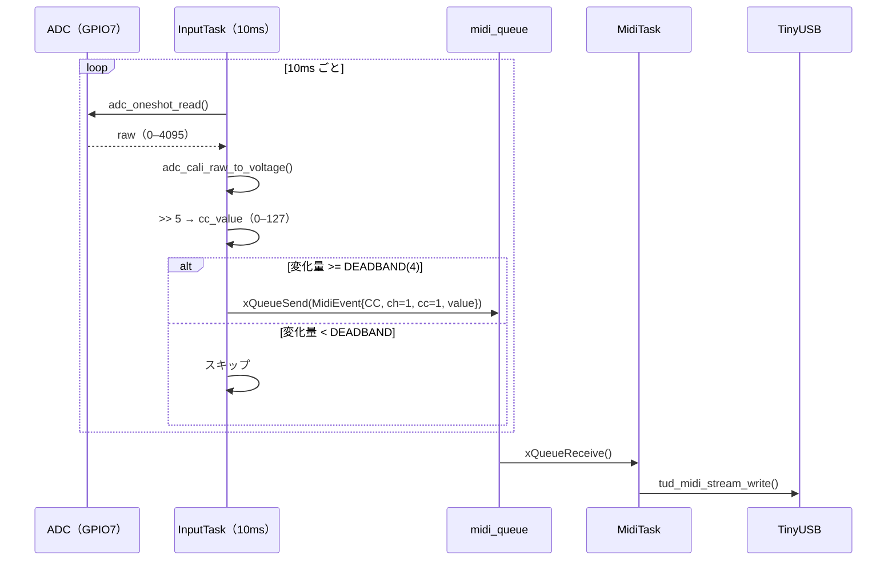

# Phase 1 — アーキテクチャ仕様書

---

## 1. クラス図



---

## 2. FreeRTOS タスク構成



| タスク | コア | 優先度 | スタック | 役割 |
|---|---|---|---|---|
| UsbTask | 1 | 6 | 4096 | `tud_task()` を専用ループで実行 |
| InputTask | 0 | 5 | 4096 | ADC + GPIO を 10ms ごとにポーリング |
| MidiTask | 1 | 4 | 4096 | queue からイベントを取り出して USB 送信 |

> InputTask を Core0 に分散することで、UsbTask（Core1, prio=6）がInputTaskのCPU時間を奪うリスクを排除。

---

## 3. データフロー（MIDI 送信）



---

## 4. インターフェース定義

```cpp
/** @brief アナログ入力の抽象インターフェース */
class IAnalogInput {
public:
    virtual ~IAnalogInput() = default;
    /** @brief ADCキャリブレーション済みの電圧をスケール変換した値を返す
     *  @return mV値をADC12bitレンジ（0–4095）に再スケールした値
     *          （0mV → 0, 3300mV → 4095）
     *          rawのADC値ではなく、adc_cali_raw_to_voltage()適用後の値
     */
    virtual uint16_t read() const = 0;
};

/** @brief ボタン入力の抽象インターフェース */
class IButton {
public:
    virtual ~IButton() = default;
    /** @brief ボタンが押されていれば true */
    virtual bool is_pressed() const = 0;
};

/** @brief MIDI 送信の抽象インターフェース */
class IMidiSender {
public:
    virtual ~IMidiSender() = default;
    /** @brief CC メッセージを送信する
     *  @param ch      MIDIチャンネル（1–16）
     *  @param cc      CC番号（0–127）
     *  @param val     CC値（0–127）
     */
    virtual void send_cc(uint8_t ch, uint8_t cc, uint8_t val) = 0;
    /** @brief Note On を送信する */
    virtual void send_note_on(uint8_t ch, uint8_t note, uint8_t vel) = 0;
    /** @brief Note Off を送信する */
    virtual void send_note_off(uint8_t ch, uint8_t note) = 0;
    /** @brief USB MIDI として接続済みなら true */
    virtual bool is_connected() const = 0;
};
```

---

## 5. データ構造

```cpp
/** @brief タスク間で受け渡す MIDI イベント */
struct MidiEvent {
    enum class Type : uint8_t { CC, NOTE_ON, NOTE_OFF };
    Type    type;
    uint8_t channel;  ///< 1–16
    uint8_t number;   ///< CC番号 or ノート番号
    uint8_t value;    ///< 0–127
};
```
