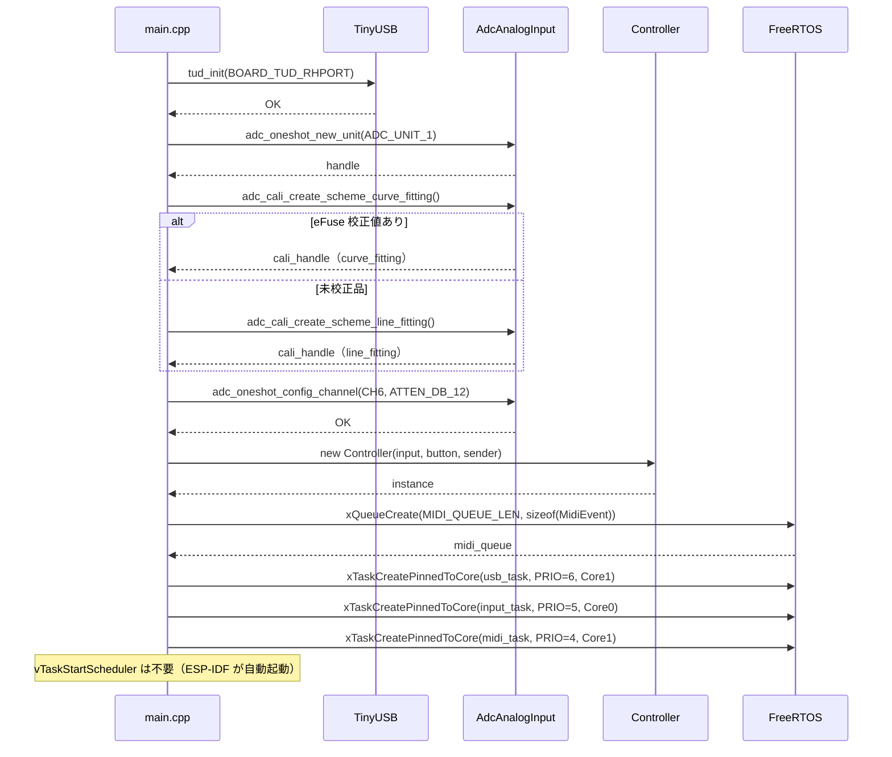
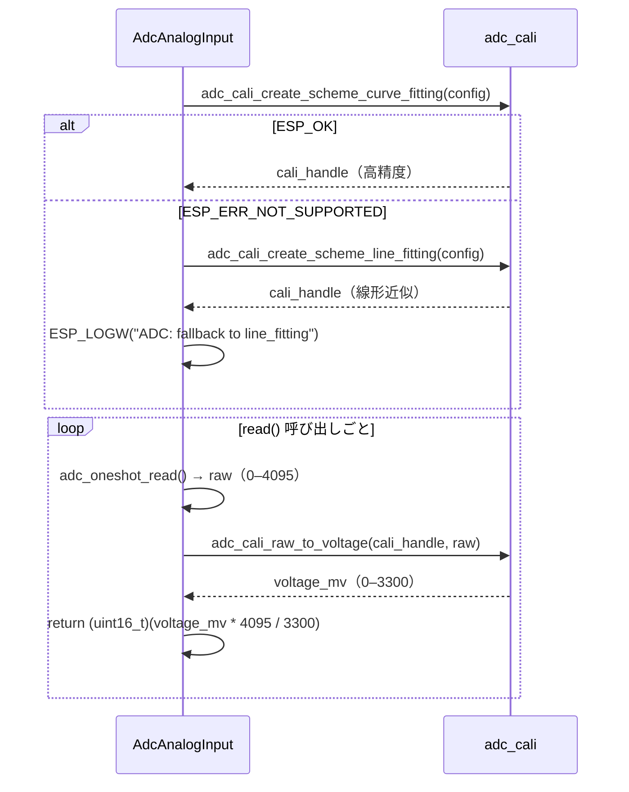

# Phase 1 — ソフトウェア設計書

---

## 1. ファイル構成

```
main/
  include/
    config.h          ← ピン・CC番号・FreeRTOS定数（constexpr）
    analog_input.h    ← IAnalogInput / AdcAnalogInput / StubAnalogInput
    button.h          ← IButton / GpioButton / StubButton
    midi_sender.h     ← IMidiSender
    usb_midi.h        ← UsbMidiSender
    controller.h      ← Controller
  src/
    main.cpp          ← 初期化・タスク起動のみ
    analog_input.cpp
    button.cpp
    usb_midi.cpp
    controller.cpp
```

---

## 2. config.h

```cpp
// ── ピン定義 ──────────────────────────────────────
constexpr gpio_num_t PIN_FADER_1  = GPIO_NUM_7;   ///< ADC1_CH6
constexpr gpio_num_t PIN_BUTTON_1 = GPIO_NUM_16;

// ── ADC ───────────────────────────────────────────
constexpr adc_unit_t    ADC_UNIT        = ADC_UNIT_1;
constexpr adc_channel_t ADC_CH_FADER_1  = ADC_CHANNEL_6;
constexpr adc_atten_t   ADC_ATTEN       = ADC_ATTEN_DB_12; ///< 0–3.3V フルレンジ

// ── MIDI ──────────────────────────────────────────
constexpr uint8_t MIDI_CHANNEL   = 1;
constexpr uint8_t CC_FADER_1     = 1;
constexpr uint8_t NOTE_BUTTON_1  = 36;
constexpr int     DEADBAND       = 4;  ///< CC値変化の最小閾値

// ── FreeRTOS ──────────────────────────────────────
constexpr int MIDI_QUEUE_LEN  = 32;
constexpr int STACK_USB       = 4096;
constexpr int STACK_INPUT     = 4096;
constexpr int STACK_MIDI      = 4096;
constexpr int PRIO_USB        = 6;
constexpr int PRIO_INPUT      = 5;
constexpr int PRIO_MIDI       = 4;
constexpr int CORE_USB        = 1;  ///< UsbTask + MidiTask
constexpr int CORE_INPUT      = 0;  ///< InputTask（USB割り込みと分離）

// ── ビルド切り替え ────────────────────────────────
// #define USE_STUBS  ← 定義するとハードウェアをスタブに差し替え
```

---

## 3. 初期化シーケンス



---

## 4. ADC キャリブレーション

ESP32-S3 の ADC は非線形のため `adc_cali` による補正が必須。



---

## 5. エラー処理方針

| エラー | 対処 |
|---|---|
| ADC 初期化失敗 | `ESP_ERROR_CHECK` でアボート（起動時） |
| キャリブレーション未対応 | line_fitting にフォールバック、`ESP_LOGW` で警告 |
| USB 未接続 | `tud_mounted() == false` の間は queue に積まない |
| USB 切断（ホットプラグ） | `tud_umount_cb()` で queue をフラッシュ（`xQueueReset`） |
| USB 再接続（ホットプラグ） | `tud_mount_cb()` で `prev_cc_ = 0xFF` にリセット → 全CC強制送信でAbleton同期を回復 |
| queue フル | `xQueueSend` 失敗時はイベントを捨てる（最新値を優先） |
| `tud_midi_stream_write` 失敗 | ログ出力のみ、リトライなし（次のイベントで上書き） |

### USB ホットプラグ コールバック実装

```cpp
/** @brief USB切断時: 送信バッファをフラッシュして古いイベントを捨てる */
void tud_umount_cb(void) {
    extern QueueHandle_t midi_queue;
    xQueueReset(midi_queue);
}

/** @brief USB再接続時: prev_cc_を無効値にリセットして全CCを強制再送信 */
void tud_mount_cb(void) {
    // Controller::input_loop() 内で prev_cc_ != 0xFF のとき deadband チェック
    // 0xFF は有効な CC 値（0–127）の範囲外 → 次のポーリングで必ず送信される
    controller.reset_prev_cc();
}
```

> TinyUSB の `tud_task()` が再列挙を自動処理するため、UsbTask は特別な再初期化不要。

---

## 6. GpioButton デバウンス設計

タクトスイッチはチャタリングが発生するため、ソフトウェアデバウンスが必要。

```cpp
/** @brief GPIO ボタン（デバウンス付き）
 *
 *  is_pressed() 呼び出しごとに現在のGPIO値を読み、
 *  前回読み取りから DEBOUNCE_MS 以上経過しているときだけ内部状態を更新する。
 */
class GpioButton : public IButton {
    static constexpr TickType_t DEBOUNCE_MS = 10;  ///< チャタリング除去時間
    gpio_num_t  pin_;
    bool        state_;          ///< デバウンス済みの現在状態
    TickType_t  last_change_;    ///< 最後に状態が変化した tick
public:
    explicit GpioButton(gpio_num_t pin);
    bool is_pressed() const override;
};
```

> InputTask の 10ms ポーリング間隔と DEBOUNCE_MS=10 が一致しているため、
> 実質的に 1 ポーリング分のフィルタになる。

---

## 7. midi_queue オーナーシップ

| 責務 | 担当 |
|---|---|
| `xQueueCreate` | `main.cpp`（起動時に1回） |
| `xQueueDelete` | `main.cpp`（通常は呼ばれない） |
| `xQueueSend` | `Controller::input_loop()` |
| `xQueueReceive` | `Controller::midi_loop()` |
| `xQueueReset` | `tud_umount_cb()`（USB切断時） |

Controller は `QueueHandle_t` をコンストラクタで受け取る。
queue のライフタイムは main.cpp が管理し、Controller より長く存在することを保証する。

```cpp
// main.cpp
QueueHandle_t midi_queue = xQueueCreate(MIDI_QUEUE_LEN, sizeof(MidiEvent));
Controller controller(input, button, sender, midi_queue);
```

---

## 8. ADC → MIDI 変換

```cpp
/** @brief 12bit ADC生値を7bit MIDI CC値に変換する
 *  @param raw  adc_oneshot_read() の生値（0–4095）
 *  @return     MIDI CC値（0–127）
 */
uint8_t to_midi_cc(uint16_t raw) {
    return static_cast<uint8_t>(raw >> 5);
}

// deadband チェック（Controller::input_loop 内）
uint8_t new_cc = to_midi_cc(input_.read());
if (std::abs(static_cast<int>(new_cc) - static_cast<int>(prev_cc_)) >= DEADBAND) {
    MidiEvent ev{MidiEvent::Type::CC, MIDI_CHANNEL, CC_FADER_1, new_cc};
    xQueueSend(midi_queue_, &ev, 0);
    prev_cc_ = new_cc;
}
```

---

## 9. テストケース

### ユニットテスト（GoogleTest・PC上）

| # | テストケース | 期待値 |
|---|---|---|
| 1 | `to_midi_cc(0)` | `0` |
| 2 | `to_midi_cc(4095)` | `127` |
| 3 | `to_midi_cc(2048)` | `64` |
| 4 | deadband: prev=64, new=67（変化量3） | イベント生成されない |
| 5 | deadband: prev=64, new=68（変化量4） | イベント生成される |
| 6 | USB未接続（`is_connected()==false`）時 | queueにイベントが積まれない |
| 7 | queue フル時に `xQueueSend` 失敗 | クラッシュしない |
| 8 | StubAnalogInput を差し込んだ Controller | 固定値 2048 → CC 64 が送信される |
| 9 | `tud_umount_cb()` 呼び出し後 | queue が空になる |
| 10 | `reset_prev_cc()` 後に input_loop() を1回実行 | prev_cc_ = 0xFF → deadband を超えて必ずイベント生成 |

### E2E確認（手動）

1. `idf.py flash` でファームウェアを書き込む
2. PC の MIDI デバイス一覧に `ESP32-S3 MIDI` が表示されることを確認
3. Ableton の MIDI 入力モニターを開いてフェーダーを動かす
4. CC 1 の値が 0–127 で変化することを確認
