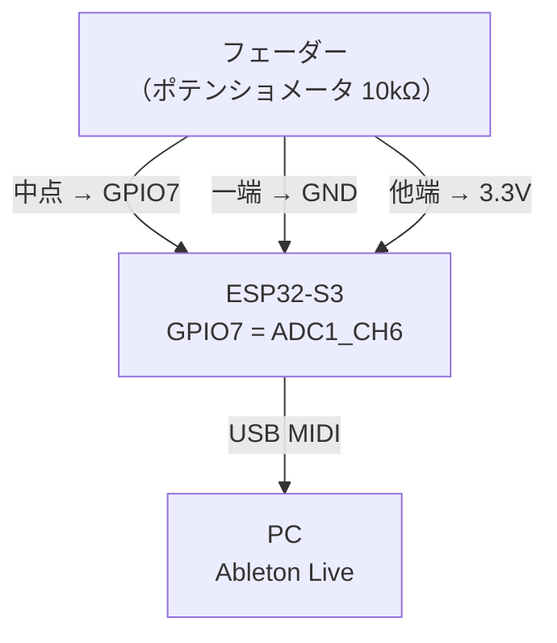
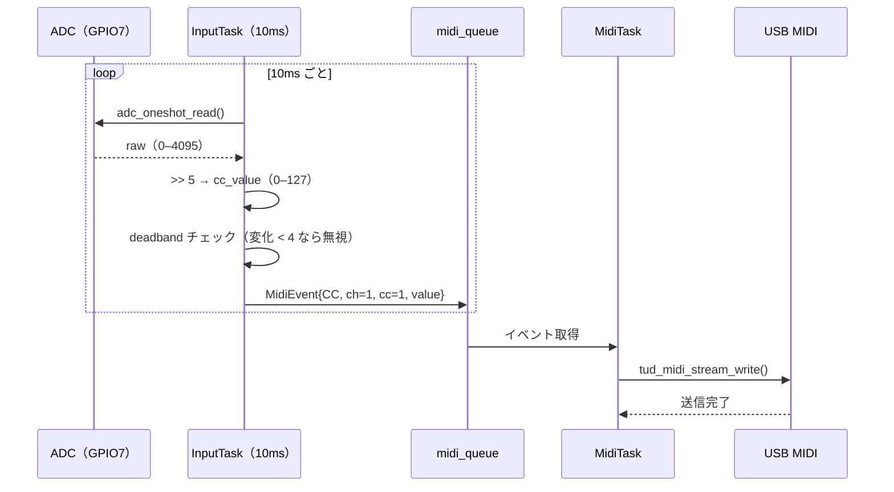

# Phase 1 — USB MIDI E2E

**目標**: フェーダー1本でAbletonのCC値が変わることを確認する

**完了条件**:
1. ESP32-S3 が USB MIDI デバイスとして PC に認識される
2. フェーダーを動かすと Ableton の MIDI 入力モニターに CC 値が表示される

---

## 1. ハードウェア構成

MUX・LED・OLEDなし。フェーダー1本 + ボタン1個の最小構成。



**フェーダー配線**

| フェーダー端子 | 接続先 |
|---|---|
| 一端（左） | GND |
| 中点（ワイパー） | GPIO7（ADC1_CH6） |
| 他端（右） | 3.3V |

**ボタン配線**

| ボタン端子 | 接続先 |
|---|---|
| 一端 | GPIO16 |
| 他端 | GND |

GPIO16 は内部プルアップ（`GPIO_PULLUP_ENABLE`）を使用。ボタン押下でLowになる。

> ⚠️ GND は ESP32-S3 と共通にすること。別電源にするとノイズが乗る。

---

## 2. ソフトウェア構成

FreeRTOS タスク 2本のみ。



### ファイル構成（Phase 1スコープ）

```
main/
  include/
    config.h        ← GPIO番号・CC番号（constexpr）
    analog_input.h  ← IAnalogInput インターフェース
    midi_sender.h   ← IMidiSender インターフェース
    usb_midi.h
    controller.h
  src/
    main.cpp        ← 初期化・タスク起動のみ
    analog_input.cpp
    usb_midi.cpp
    controller.cpp
```

---

## 3. データ構造

```cpp
/** @brief タスク間で受け渡すMIDIイベント */
struct MidiEvent {
    enum class Type : uint8_t { CC, NOTE_ON, NOTE_OFF };
    Type    type;
    uint8_t channel;  ///< 1–16
    uint8_t number;   ///< CC番号 or ノート番号
    uint8_t value;    ///< 0–127
};
```

---

## 4. ADC 読み取り

```cpp
// 12bit → 7bit 変換
uint8_t to_midi_cc(uint16_t raw) { return raw >> 5; }

// deadband: 変化量が4未満なら無視（CC値の暴れ防止）
if (abs((int)new_val - (int)prev_val) >= 4) {
    // MidiEvent を queue に積む
}
```

**注意点**
- `adc_legacy` API は禁止 → `adc_oneshot` + `adc_cali` を使うこと
- キャリブレーション（`adc_cali_create_scheme_curve_fitting`）を初期化時に実行すること
- ADC1 は GPIO1–10 のみ使用可能

---

## 5. TinyUSB 設定

**注意点**
- `tusb_config.h` で `CFG_TUD_MIDI = 1` を確認してからビルドすること
- `tud_task()` をメインループまたは専用タスクで必ず呼ぶこと（呼ばないとUSBが動かない）
- USB Vendor ID / Product ID は `tusb_config.h` で設定

---

## 6. テスト

### ユニットテスト（GoogleTest・PC上）
- `to_midi_cc(0)` → `0`
- `to_midi_cc(4095)` → `127`
- `to_midi_cc(2048)` → `64`
- deadband: 変化量3以下でイベントが生成されないこと
- deadband: 変化量4以上でイベントが生成されること

### E2E確認（手動）
1. `idf.py flash` でファームウェアを書き込む
2. PC の MIDI デバイス一覧に `ESP32-S3 MIDI` が表示されることを確認
3. Ableton の MIDI 入力モニターを開いてフェーダーを動かす
4. CC 1 の値が 0–127 で変化することを確認

> ボタンの Note On/Off 確認は Phase 3 で実施する
