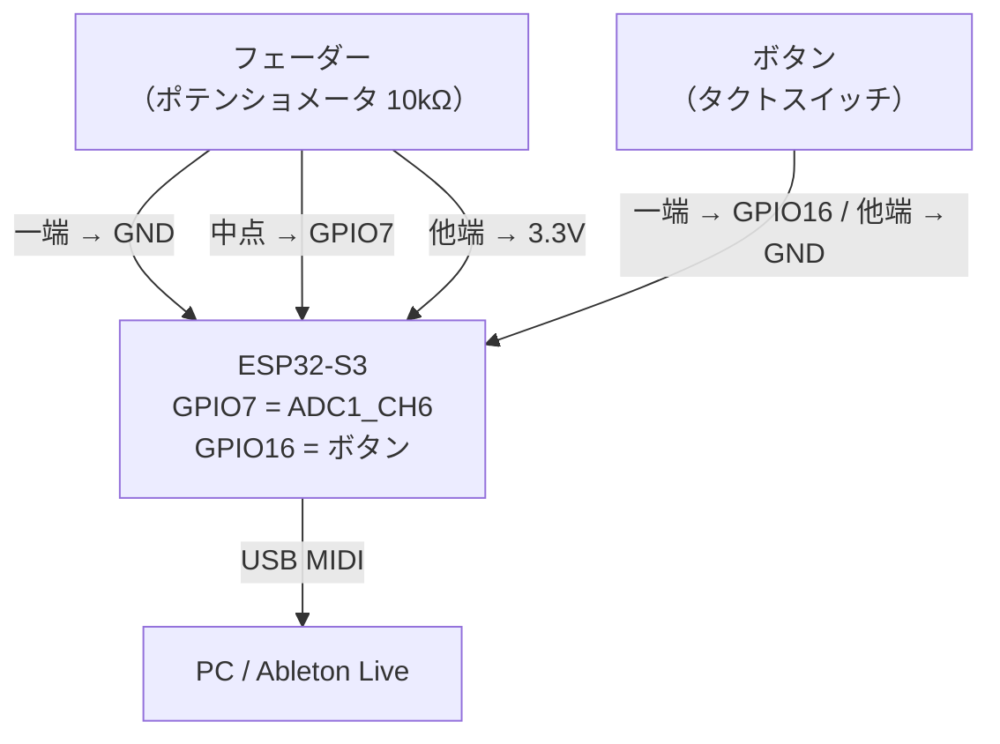

# Phase 1 — USB MIDI E2E

**目標**: フェーダー1本でAbletonのCC値が変わることを確認する

| ドキュメント | 内容 |
|---|---|
| [phase1_arch.md](phase1_arch.md) | クラス図・タスク構成・シーケンス図 |
| [phase1_sw_design.md](phase1_sw_design.md) | 初期化手順・config.h・エラー処理・テスト |

---

## 完了条件

1. ESP32-S3 が USB MIDI デバイスとして PC に認識される
2. フェーダーを動かすと Ableton の MIDI 入力モニターに CC 値が表示される

> ボタンの Note On/Off 確認は Phase 3 で実施する

---

## ハードウェア構成

MUX・LED・OLEDなし。フェーダー1本 + ボタン1個の最小構成。



---

## ブレッドボード配線図

ESP32-S3-DevKitC-1-N8 のピン番号で記載。

```
ESP32-S3-DevKitC-1
┌─────────────────────────────┐
│  [USB-C] ←── PC へ          │
│                             │
│  3V3  ●──────────────── フェーダー右端（VCC）
│  GND  ●──────┬─────────── フェーダー左端（GND）
│              └──────────── ボタン片端（GND）
│  IO7  ●──────────────── フェーダー中点（ワイパー）
│  IO16 ●──────────────── ボタン片端
│                             │
└─────────────────────────────┘

フェーダー（10kΩ ポテンショメータ）:
  左端   → GND
  中点   → GPIO7
  右端   → 3.3V

ボタン（タクトスイッチ）:
  片端   → GPIO16（内部プルアップ有効）
  もう片端 → GND
```

**ピン対応表**

| 部品 | 部品端子 | ESP32-S3 ピン | 備考 |
|------|---------|--------------|------|
| フェーダー | 左端（CCW） | GND | |
| フェーダー | 中点（ワイパー） | IO7 | ADC1_CH6 |
| フェーダー | 右端（CW） | 3V3 | |
| ボタン | 端子A | IO16 | 内部プルアップ使用 |
| ボタン | 端子B | GND | |

> ⚠️ GND は ESP32-S3 と共通にすること。別電源にするとノイズが乗る。  
> ⚠️ GPIO7 に直接触れると静電気で ADC 値が乱れる。テスト時はフェーダーを必ず接続した状態で行うこと。
