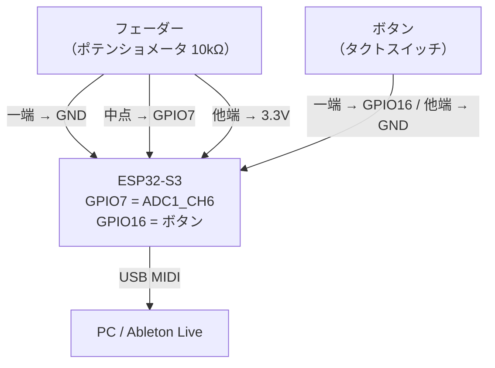

# Phase 1 — USB MIDI E2E

**目標**: フェーダー1本でAbletonのCC値が変わることを確認する

| ドキュメント | 内容 |
|---|---|
| [phase1_arch.md](phase1_arch.md) | クラス図・タスク構成・シーケンス図 |
| [phase1_sw_design.md](phase1_sw_design.md) | 初期化手順・config.h・エラー処理・テスト |

---

## 完了条件

1. ESP32-S3 が USB MIDI デバイスとして PC に認識される
2. フェーダーを動かすと Ableton の MIDI 入力モニターに CC 値が表示される

> ボタンの Note On/Off 確認は Phase 3 で実施する

---

## ハードウェア構成

MUX・LED・OLEDなし。フェーダー1本 + ボタン1個の最小構成。

**フェーダー配線**

| フェーダー端子 | 接続先 |
|---|---|
| 一端（左） | GND |
| 中点（ワイパー） | GPIO7（ADC1_CH6） |
| 他端（右） | 3.3V |

**ボタン配線**

| ボタン端子 | 接続先 |
|---|---|
| 一端 | GPIO16 |
| 他端 | GND |

GPIO16 は内部プルアップ（`GPIO_PULLUP_ENABLE`）を使用。ボタン押下でLowになる。

> ⚠️ GND は ESP32-S3 と共通にすること。別電源にするとノイズが乗る。
