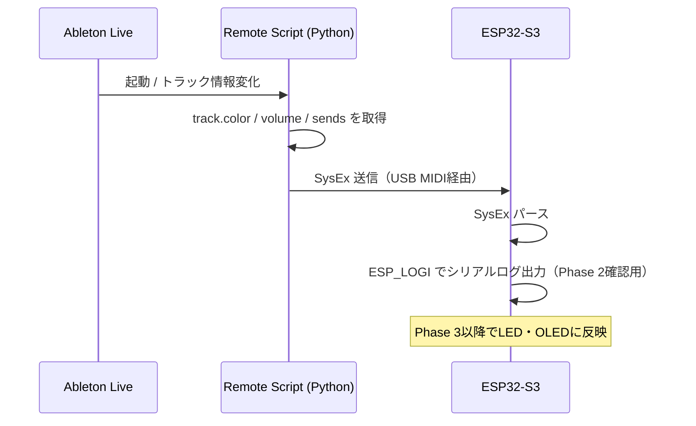

# Phase 2 — Ableton Remote Script（双方向SysEx通信）

**前提**: Phase 1 完了済み（USB MIDI E2E 動作確認済み）

**目標**: Ableton のトラックカラー・ボリューム・ノブ値を SysEx で受信し、シリアルログで確認する

**完了条件**:
1. Remote Script が Ableton に認識される
2. トラックカラー変化時に SysEx が ESP32-S3 に届き、シリアルログに RGB 値が表示される
3. トラックボリューム・ノブ値も同様に受信確認できる

---

## 1. 通信フロー



---

## 2. SysEx フォーマット

```
F0 7D <type> <index> <data...> F7

F0   : SysEx 開始
7D   : Manufacturer ID（非商用・研究用）
type : メッセージ種別（下表）
index: トラック番号（0–11）またはノブ番号（0–2）
F7   : SysEx 終了
```

| type | 用途 | data |
|---|---|---|
| `01` | トラックカラー | `<R> <G> <B>`（各 0–127） |
| `02` | トラックボリューム | `<value>`（0–127） |
| `03` | ノブ値 | `<bank> <value>`（bank: 0=Bank1/1=Bank2、value: 0–127） |

**例**: トラック0のカラーを赤（R=127, G=0, B=0）に設定
```
F0 7D 01 00 7F 00 00 F7
```

**例**: ノブ2（index=1）のBank1の値を64に設定
```
F0 7D 03 01 00 40 F7
         ^  ^  ^  ^
         |  |  |  value=64
         |  |  bank=0（Bank1）
         |  index=1（ノブ2）
         type=03（ノブ値）
```

---

## 3. Remote Script

### ファイル構成

```
remote-script/
  MidiController/
    __init__.py        ← create_instance() エントリポイント
    MidiController.py  ← ControlSurface サブクラス
```

### 配置方法

```
<Ableton インストール>/Resources/MIDI Remote Scripts/MidiController/
```

Ableton 環境設定 > MIDI > コントロールサーフェスで `MidiController` を選択し、
Input / Output に `ESP32-S3 MIDI` を設定。

### 監視する情報

| 情報 | Ableton API | 送信タイミング |
|---|---|---|
| トラックカラー | `track.color` | 変化時 |
| トラックボリューム | `track.mixer_device.volume.value` | 変化時 |
| ノブ値（Send） | `track.mixer_device.sends[n].value` | 変化時・接続時 |

---

## 4. テスト

### E2E確認（手動）
1. Remote Script を Ableton の指定フォルダに配置する
2. Ableton を起動し、環境設定でスクリプトを選択する
3. シリアルモニター（`idf.py monitor`）を開く
4. Ableton でトラックカラーを変更する
5. シリアルログに `SysEx received: type=01 index=00 R=xx G=xx B=xx` が表示されることを確認する
