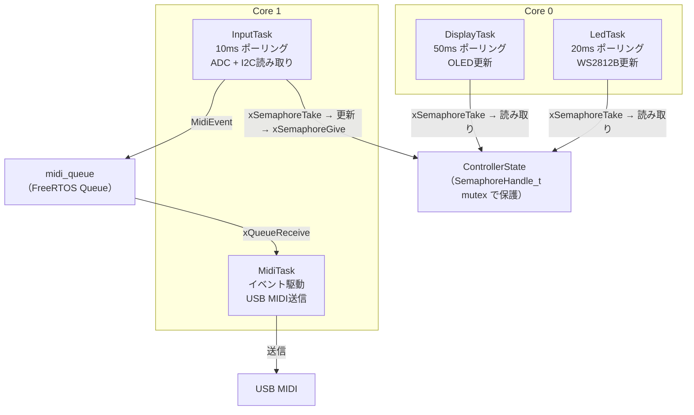
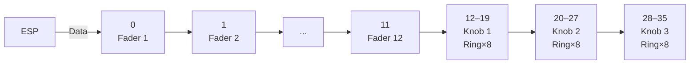

# Phase 3 — フル入出力構成（MUXなし）

**前提**: Phase 2 完了済み（双方向SysEx通信確認済み）

**目標**: フェーダー・ボタン・LED・OLED がすべて連携して動く

**完了条件**:
1. フェーダーを動かすと対応するLEDの輝度が変わる
2. AbletonのトラックカラーがフェーダーLEDの色に反映される
3. OLEDに現在のCC値・バンク名・直近MIDIイベントが表示される
4. ボタン操作でNote On/Offが送信される

---

## 1. 追加コンポーネント

| 追加項目 | 仕様 |
|---|---|
| フェーダー | ポテンショメータ 10kΩ × 数本（ADC1直結） |
| ボタン（MIDI用） | タクトスイッチ × 8（PCF8574 #1 経由） |
| バンク切り替えボタン | タクトスイッチ × 2（PCF8574 #2 経由） |
| I2C GPIOエクスパンダ | PCF8574 × 2（I2Cアドレス: 0x20 / 0x21） |
| LED | WS2812B × 36（RMT経由） |
| ディスプレイ | SSD1306 OLED 128×64（I2C） |

---

## 2. FreeRTOS タスク構成



---

## 3. ControllerState

```cpp
/** @brief 全コントロールの現在値を保持するグローバル状態 */
struct ControllerState {
    uint8_t fader[12];          ///< CC値 0–127
    uint8_t knob[3];            ///< CC値 0–127（現在バンクの値）
    uint8_t button[8];          ///< 0 or 127
    uint8_t knob_bank;          ///< 0=Bank1(SEND) / 1=Bank2(PLUGIN)
    uint8_t track_color[12][3]; ///< RGB（SysExで受信、各 0–127）
    uint8_t track_volume[12];   ///< ボリューム値（SysExで受信）
    MidiEvent last_event;       ///< 直近の送信MIDIイベント
};
```

---

## 4. LED 仕様

### インデックス配置



| インデックス | 対象 |
|---|---|
| 0–11 | フェーダー 1–12 |
| 12–19 | ノブ1 リング（8個） |
| 20–27 | ノブ2 リング（8個） |
| 28–35 | ノブ3 リング（8個） |

### フェーダー LED（インデックス 0–11）

トラックカラーを基色、フェーダーCC値で輝度を変調する。

```cpp
uint8_t br = map(cc_value, 0, 127, MIN_DIM, MAX_BRIGHTNESS);
// MIN_DIM = 30, MAX_BRIGHTNESS = 64
led.set(i, color.r * br / 255, color.g * br / 255, color.b * br / 255);
```

### ノブ LED リング（インデックス 12–35）

CC値に応じて点灯数が変わるリングメーター。

```
点灯数 = round(cc_value / 127.0 × 8)  // 最小1個は常時点灯
```

| バンク | 内容 | リング色 |
|---|---|---|
| Bank1 | SEND（Reverb/Delay/Lo-cut） | 青系 |
| Bank2 | PLUGIN（param 1–3） | 緑系 |

---

## 5. OLED 表示

```
┌────────────────┐
│ USB ● connected│  ← 接続状態
│ Bank: SEND     │  ← 現在のノブバンク名
│ 1: Reverb      │  ← ノブラベル
│ 2: Delay       │
│ 3: Lo-cut      │
│ > CC1 :  87    │  ← 直近の送信MIDIイベント
└────────────────┘
```

ライブラリ: `esp_lcd` コンポーネント（外部ライブラリ禁止）

---

## 6. テスト

### ユニットテスト（GoogleTest・PC上）
- LED輝度計算: `cc=0` → `MIN_DIM`、`cc=127` → `MAX_BRIGHTNESS`
- リングメーター: `cc=0` → 点灯数1、`cc=127` → 点灯数8
- ControllerState の mutex 保護: 複数スレッドから同時アクセスしても壊れないこと

### ハードウェアテスト（ESP-IDF Unity・実機）
- WS2812B: 指定インデックスに指定色が点灯すること
- OLED: 文字列が正しい座標に表示されること
- ボタン: PCF8574からI2Cで読み取り、チャタリング除去後に正しくイベントが生成されること
- PCF8574: 2個同時押しが独立して検出されること
