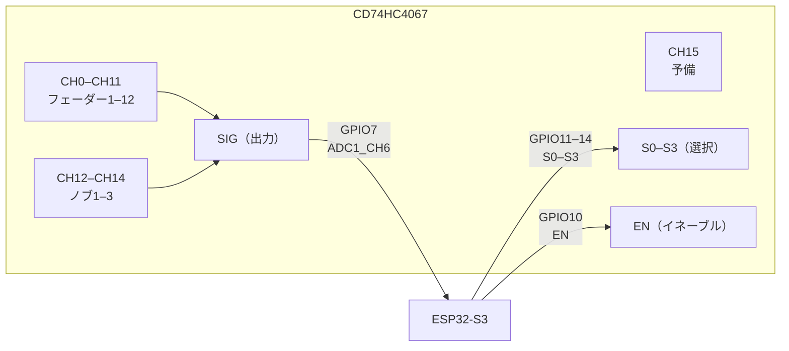
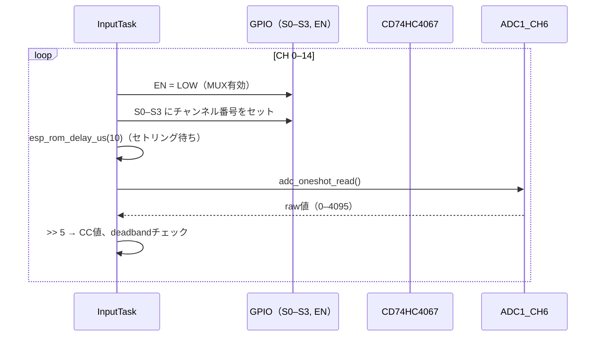

# Phase 4 — MUX導入（フェーダー12本）

**前提**: Phase 3 完了済み

**目標**: CD74HC4067 経由でフェーダー12本 + ノブ3本を読み取る

**完了条件**:
1. 全フェーダー（12本）のCC値が独立して正しく変化する
2. 隣接チャンネルのクロストーク（前チャンネルの値を読む）が発生しない
3. ノブ3本も同様に正常読み取り確認

---

## 1. CD74HC4067 接続

| 信号 | GPIO（仮） | 説明 |
|---|---|---|
| SIG | GPIO7（ADC1_CH6） | MUX出力 → ADC入力 |
| S0 | GPIO11 | チャンネル選択ビット0 |
| S1 | GPIO12 | チャンネル選択ビット1 |
| S2 | GPIO13 | チャンネル選択ビット2 |
| S3 | GPIO14 | チャンネル選択ビット3 |
| EN | GPIO10 | LOWでMUX有効 |

---

## 2. チャンネル割り当て

| MUX CH | 対象 |
|---|---|
| 0–11 | フェーダー 1–12 |
| 12–14 | ノブ 1–3 |
| 15 | 予備 |

---

## 3. 読み取りシーケンス

**セトリング時間について**
- チャンネル切り替え直後はMUX内部のスイッチが安定していない
- 待ち時間なしで読むと **前チャンネルの値**または**中間値**を読む
- `esp_rom_delay_us(10)` で 10μs 待つこと（フェーダーのインピーダンスによっては増やす）

---

## 4. テスト

### ハードウェアテスト（ESP-IDF Unity・実機）
- 各チャンネルを個別に動かしたとき、他チャンネルの値が変化しないこと（クロストーク確認）
- セトリング時間を 0μs にすると値がずれることを確認（仕様の理解）
- 全16チャンネルを順番に読んで、CH15が正しく予備として機能すること
