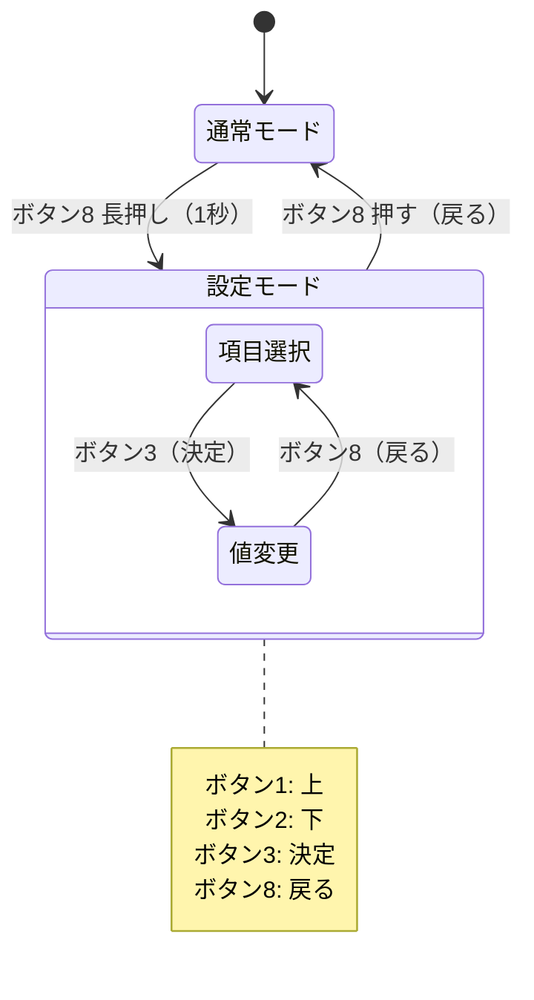

# Phase 5 — 最終仕上げ

**前提**: Phase 4 完了済み（全ハードウェア動作確認済み）

**目標**: 設定の永続化・起動演出・接続演出を追加して完成形にする

**完了条件**:
1. CC番号・ラベルを変更して電源を切っても設定が保持される
2. 起動時にアニメーションが再生される
3. USB 接続確立時に演出が表示される

---

## 1. 設定システム（NVS）

ESP-IDF の NVS（Non-Volatile Storage）を使い、設定をフラッシュに保存する。

### 保存する設定項目

| 項目 | デフォルト値 |
|---|---|
| MIDIチャンネル | 1 |
| フェーダー CC番号 1–12 | CC 1–12 |
| フェーダーラベル 1–12 | "Track 1" 等 |
| ノブ CC番号 Bank1/2 × 3 | CC 20–25 |
| ノブラベル Bank1/2 × 3 | "Reverb" 等 |
| ボタン Note番号 1–8 | Note 36–43 |
| LED最大輝度 | 64 |
| 接続時メッセージ | "Let's go!" |

### OLEDによる設定メニュー

ボタン8（バンク2）長押し（1秒）で設定モードへ移行。

---

## 2. 起動アニメーション

1. **WS2812B ウェーブ**（約1秒）: LED が左端から右端へ順次点灯
2. **OLED 波形アニメーション**（約1秒）: サイン波が流れる
3. 通常画面へ移行

---

## 3. 接続時演出

USB 接続確立時：
- OLED に設定済みメッセージを2秒表示（デフォルト: `"Let's go!"`）
- LED が全点灯 → フェードインして通常輝度へ

---

## 4. テスト

### ユニットテスト（GoogleTest・PC上）
- NVS 読み書きのラッパー関数が正しく動作すること（モックNVSを使用）

### ハードウェアテスト（ESP-IDF Unity・実機）
- 設定を書き込んで再起動後も値が保持されること
- NVS 未初期化時にデフォルト値が使われること

### E2E確認（手動）
- 設定メニューでCC番号を変更 → Abletonで新しいCC番号が届くこと
